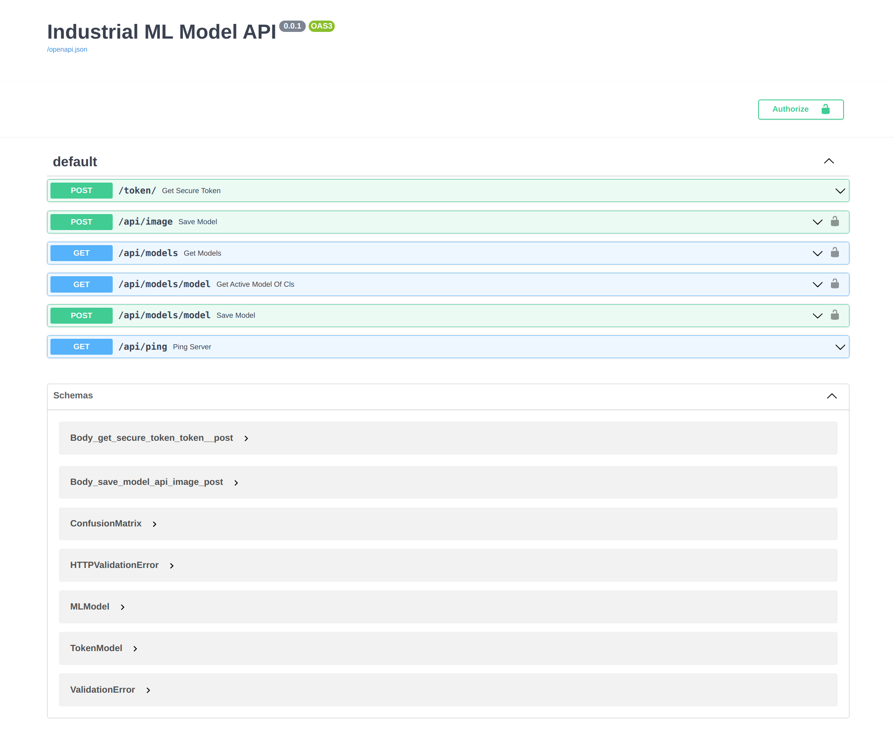

# API

## Development

Requirements:

- Python 3.9.2
- MongoDB

Setting up a Python environment:

```bash
python --version
  Python 3.9.2
```

```bash
pip install virtualenv
virtualenv venv
source ./venv/bin/activate
pip install -r requirements.txt
```

Start a development instance:

```bash
source ./venv/bin/activate
uvicorn app.main:app --reload --port 3000
```

## Testing APIs

Access all the APIs through http://localhost:3000/docs

## Project Structure

```
712 directories, 6828 files
(venv) (base)  saifulkhan  ~/CODE/COLLABORATION/example-fast-api   main ±  ls
README.md        app              config           docs             requirements.txt tests            venv
(venv) (base)  saifulkhan  ~/CODE/COLLABORATION/example-fast-api   main ±  tree app
app
├── __init__.py
├── controllers
│   ├── __init__.py
│   └── image_controller.py
├── core
│   ├── config.py /* reads the environment variables*/
│   ├── logging.py
│   └── settings.py
├── main.py          /* start entry */
├── services
│   ├── __init__.py
└── utils
    ├── __init__.py
|
|
| .env /* input environment variables*/
```

# Notes

- Used MongoDB Atlas free managed database for development and testing.
- Screenshot of the API testing panel http://localhost:3000/docs


